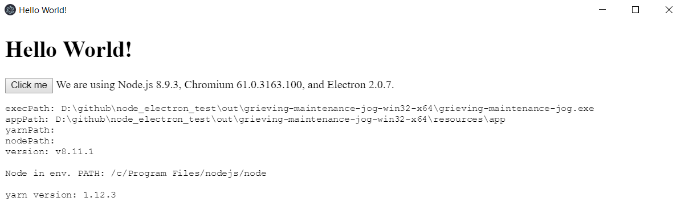
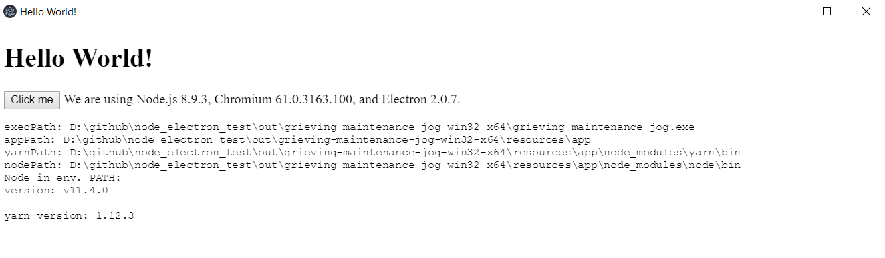

# Demo project to show usage of bundled Node & yarn

## Boilerplate for the project

This project is using electron-forge as base-

## Installation

After cloning run `yarn` to install all dependencies. Then run `yarn make` to create the app binary that will be located in `out` folder.

## What can we see in this demo?

If the end user starts the bundled app. `checkIfNodeAvailable` will check if Node is available. If it's available it will be used by the app. The app will give an output like in the following screenshot

Please notice: The line node in env. path will output the location of the node version used.

If you're not having Node installed (testwise rename the folder of your node installation e.g. from `nodejs` to `nodejs-missing` - so Node can't be found) the app will use the bundled version of Yarn & Node. The output will be like in the screenshot below

Notice: yarnPath & nodePath is not empty and will be used in the app to locate the binaries of Node & Yarn.
We're also adding Node to the path so Yarn can find the bundled Node version.
